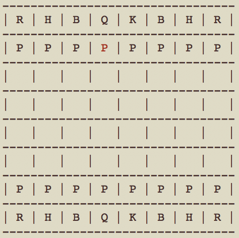

# TChess
TChess is a chess game on the terminal built using Ruby.

## Game Symbols
| Symbol  | Chess Piece |
| ------------- | ------------- |
| K  | King  |
| Q  | Queen  |
| B  | Bishop  |
| H  | Knight  |
| R  | Rook  |
| P  | Pawn  |

## Features
### Modules for Chess Pieces
Chess piece movements can be placed into three different categories: sliding pices, stepping pieces, and pawns.  Bishop, Rook and, Queen pieces have sliding movements while Knight and King pieces have stepping movements.  So, sliding and stepping piece movements were were turned into the slideable module and steppable module.  Modularization helped in maintaining clean code while reusing parts of the code for pieces of similar movements.
